# Universidad Nacional de Córdoba  
## Facultad de Ciencias Exactas, Físicas y Naturales  
### Ingeniería en Computación  

---

# Informe TP1 - Comunicaciones de Datos  

**Materia:** Comunicaciones de Datos  
**Trabajo Práctico N°:** 1  

**Alumnos:** Mateo Bernardi - Santiago Madrid  
**Año:** 2025  
**Profesor:** Ing. Facundo Oliva Cuneo - Ing. Santiago Henn
**Fecha de entrega:** 25/08/2025 

---

## Actividad 1

1) La imagen muestra una onda que tiene una frecuencia de 5 GHz y una longitud de onda de 60 mm. La longitud de onda se puede ver en el gráfico y la frecuencia se calcula de la siguiente manera: 
```
            f = (c/lamba) = 5GHz
```
Siendo f la frecuencia, c la velocidad (que en este caso es igual a la velocidad de la luz), y lambda la longitud de onda.

2) El ITU divide el planeta en 3 regiones para asignar el espectro. Dependiendo en qué región se encuentre físicamente, la asignación de frecuencia tiene ligeras modificaciones. 
Según la ITU una frecuencia de 5 GHz cae en el rango de 3 GHz a 30 GHz, el cual está asignado a las microondas, mas específicamente en la banda baja de 5 GHz de WiFi.

3) En esta frecuencia opera el WiFi moderno. Pero también hay sub-bandas en las cuales operan ciertos instrumentos de uso científico como puede ser un radar de corto alcance.

4) La línea roja representa la envolvente de atenuación de la onda, es decir, como la amplitud de la onda disminuye a medida que se avanza en el espacio.

5) Si, los radares también se ven afectados por este fenómeno. 
Por otro lado, en la vida cotidiana se puede ver el ejemplo claro con el WiFi del hogar.

6) La atenuación afecta a todas las transmisiones nombradas, puede que a alguna (cable coaxial) más que otra (fibra óptica), pero sí se ven afectadas todas.

---
## Actividad 2

1) La imagen describe una transmisión digital síncrona unidireccional.

2) Este paradigma de transmisión es mas veloz por ser síncrona, sin embargo, no se garantiza la bidireccionalidad en la imagen.

3) 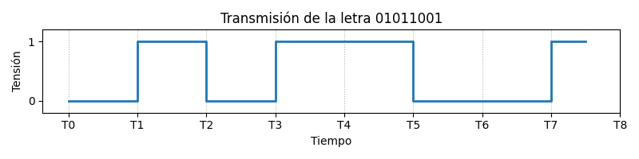

4) Las mediciones se realizan en el centro de cada intervalo de bit.

---
## Actividad 3

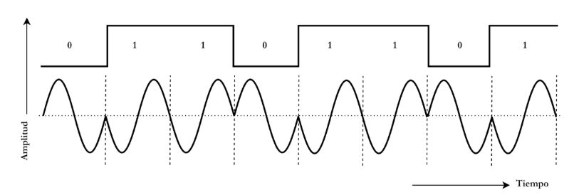

1) La imagen muestra una modulacion BPSK (Binary Phase Shift Keying). Esta varia la fase de la señal entre dos valores discretos dependiendo del bit que se quiera modular.

2) Modulacion en PSK del binario '01110110'

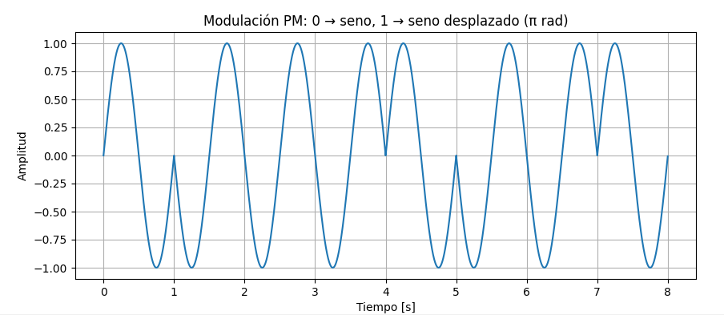

3) Se pueden encontrar modulaciones con mismos principios como FSK, M-PSK, ASK.

4) Se llama BER (Bit Error Rate) a la proporcion de bits recibidos y demodulados en el receptor que no coinciden con bits enviados en el modulo transmisor.
En cuanto a mejor BER,  la modulacion BPSK tiene una gran separacion entre simbolos, gran resistencia al ruido y solo transmite un bit por símbolo.

---
## Actividad 4

### Simulación en Cisco Packet Tracer

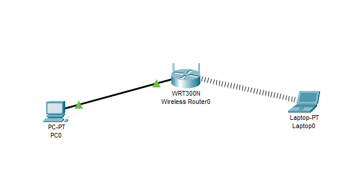
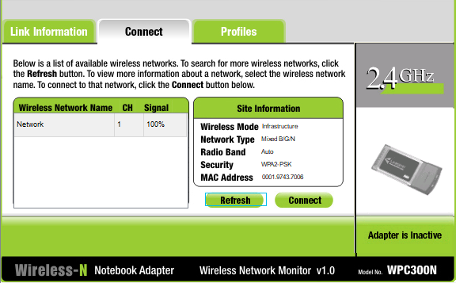
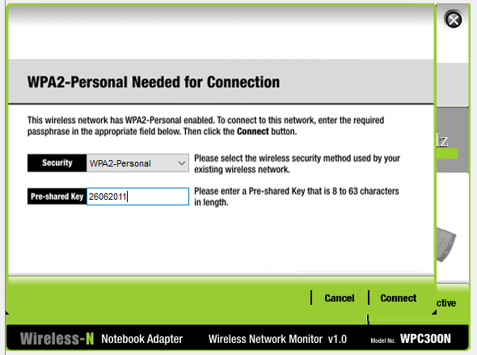
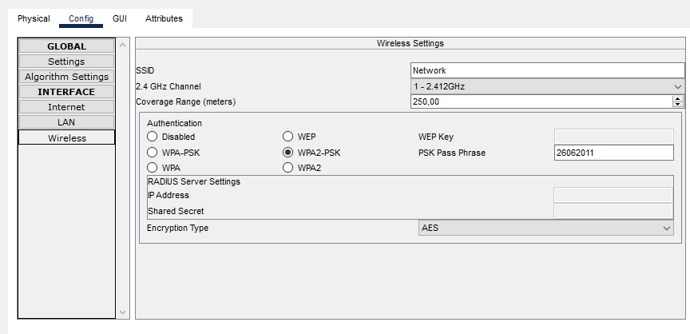
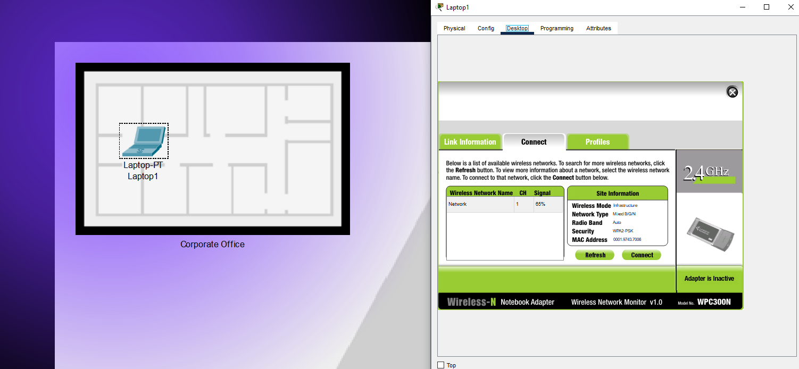
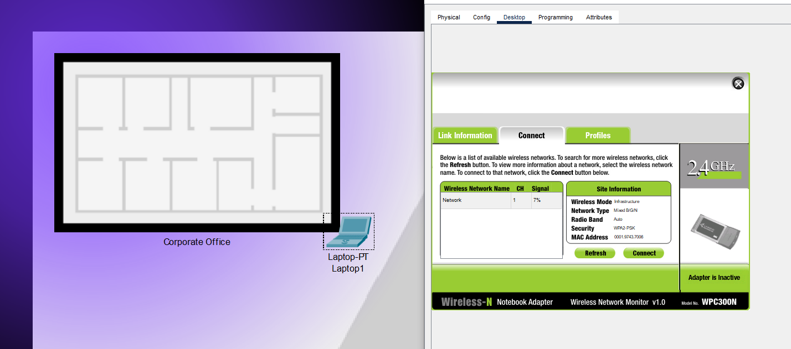
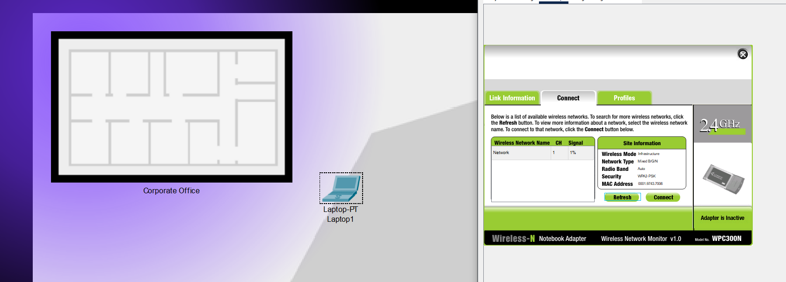
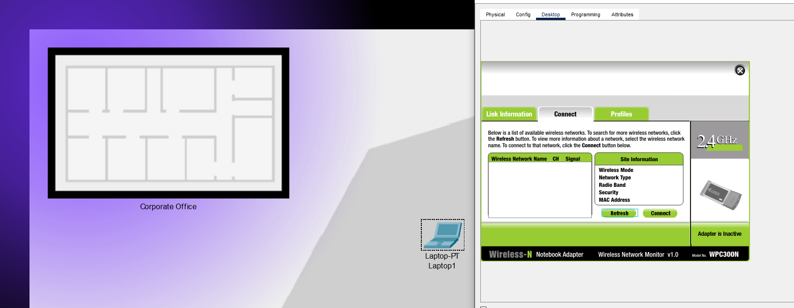

agregar imagenes, ver como hacer ping entre pc
---
