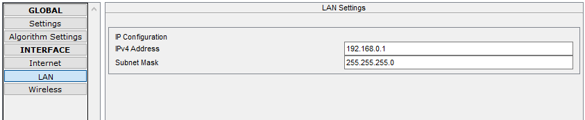
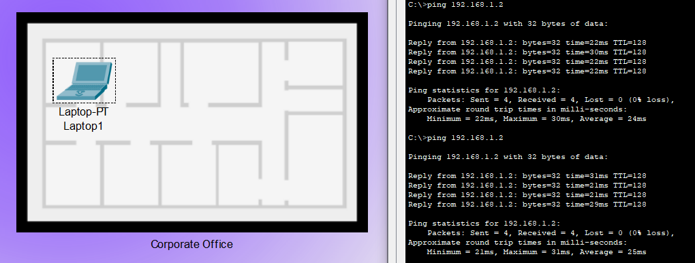
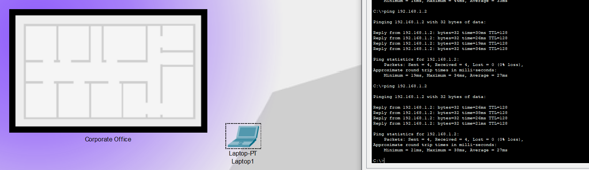
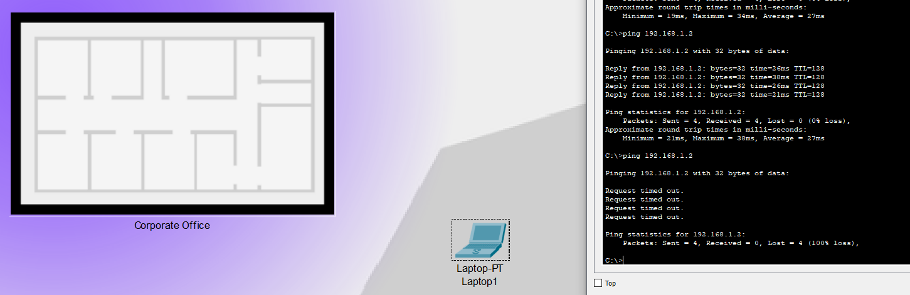

# Universidad Nacional de Córdoba

## Facultad de Ciencias Exactas, Físicas y Naturales

### Ingeniería en Computación

---

# Informe TP1 - Comunicaciones de Datos

**Materia:** Comunicaciones de Datos  
**Trabajo Práctico N°:** 1

**Alumnos:** Mateo Bernardi - Santiago Madrid  
**Año:** 2025  
**Profesor:** Ing. Facundo Oliva Cuneo - Ing. Santiago Henn
**Fecha de entrega:** 25/08/2025

---

## Actividad 1

1. La imagen muestra una onda que tiene una frecuencia de 5 GHz y una longitud de onda de 60 mm. La longitud de onda se puede ver en el gráfico y la frecuencia se calcula de la siguiente manera:

    $f = \frac{c}{\lambda}$

donde:
- $f$ es la frecuencia,
- $c$ es la velocidad de la luz ($3 \times 10^8 \, m/s$),
- $\lambda$ es la longitud de onda ($0.06 \, m$).

2. El ITU divide el planeta en 3 regiones para asignar el espectro. Dependiendo en qué región se encuentre físicamente, la asignación de frecuencia tiene ligeras modificaciones.
   Según la ITU una frecuencia de 5 GHz cae en el rango de 3 GHz a 30 GHz, el cual está asignado a las microondas, utilizado en la banda ISM de 5 GHz para WiFi.

3. En esta frecuencia opera el WiFi moderno. Pero también hay sub-bandas en las cuales operan ciertos instrumentos de uso científico como puede ser un radar de corto alcance.

4. La línea roja representa la atenuación de la amplitud de la onda con la distancia, es decir, como la amplitud de la onda disminuye a medida que se avanza en el espacio.

5. Si, los radares también se ven afectados por este fenómeno.
   Por otro lado, en la vida cotidiana se puede ver el ejemplo claro con el WiFi del hogar.

6. La atenuación afecta a todas las transmisiones nombradas, puede que a alguna (cable coaxial) más que otra (fibra óptica), pero sí se ven afectadas todas.

---

## Actividad 2

1. La imagen describe una transmisión digital síncrona unidireccional.

2. Este paradigma de transmisión síncrona es más eficiente, ya que elimina la sobrecarga de bits de arranque o parada. Sin embargo, no se garantiza la bidireccionalidad en la imagen.

3. 

4. Las mediciones se realizan en el centro de cada intervalo de bit.

---

## Actividad 3

1. La imagen muestra una modulación BPSK (Binary Phase Shift Keying). Esta varia la fase de la señal entre dos valores discretos dependiendo del bit que se quiera modular.

2. Modulación en PSK del binario '01110110'

3. Existen otras modulaciones digitales basadas en variar un parámetro de la portadora, como FSK (frecuencia), ASK (amplitud) o M-PSK (fase con más de dos estados).

4. Se llama BER (Bit Error Rate) a la proporción de bits recibidos y demodulados en el receptor que no coinciden con bits enviados en el modulo transmisor.
   En cuanto a mejor BER, la modulación BPSK tiene una gran separacion entre símbolos, gran resistencia al ruido y solo transmite un bit por símbolo.

---

## Actividad 4

### Simulación en Cisco Packet Tracer

a) En el entorno de Cisco Packet Tracer, desde la categoría Network Devices > Wireless Devices, se seleccionó un Wireless Router (WRT300N) y se colocó en el área de trabajo.

b) Configuración del Router

Se configuró la IP del router, seguridad y password de la siguiente manera.

c) Análisis de frecuencia

Como se ve en imágenes anteriores, el router opera a 2.412 GHz, frecuencia dentro del rango de microondas (3–30 GHz), específicamente en la banda ISM de 2.4 GHz utilizada por WiFi.

f) Conexión wireless al Router

Desde una Laptop nos ubicamos en la oficina y nos conectamos a la red, utilizando la seguridad configurada anteriormente.

g) Conexión entre computadoras

Tenemos conectados al router una PC de escritorio, con IP `192.168.1.2`, y una Laptop con IP `192.168.1.3`.
Para testear la conexión entre ambos dispositivos, realizamos un ping desde la consola de la Laptop a la IP de la PC de escritorio.
Luego vamos variando la posición de la Laptop para medir como cambia la conexión respecto a la distancia al Router

Intensidad de señal: 83%
Trip times average: 31ms

Intensidad de señal: 1%
Trip times average: 27ms

Intensidad de señal: Out of range
No se pudo establecer conexión entre dispositivos

#### Conclusiones

Tras la medición y comparación de resultados podemos concluir que la conexión funciona de forma muy sólida, incluso con baja intensidad de señal. No se detecta un aumento considerable del trip time a menor intensidad de señal.Solo se ven paquetes perdidos cuando el dispositivo se encuentra claramente fuera del rango del Router.
Esto puede atribuirse a que el programa Cisco Packet Tracer no representa problemáticas que si podemos tener en la vida real, como las interferencias.

