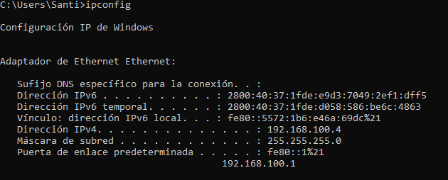
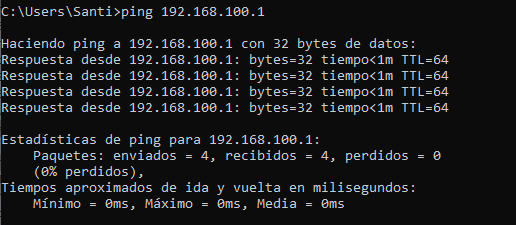
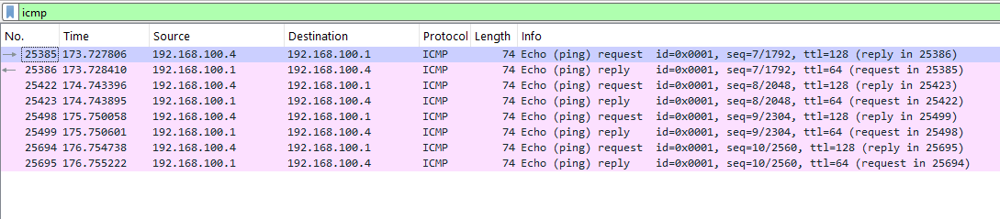
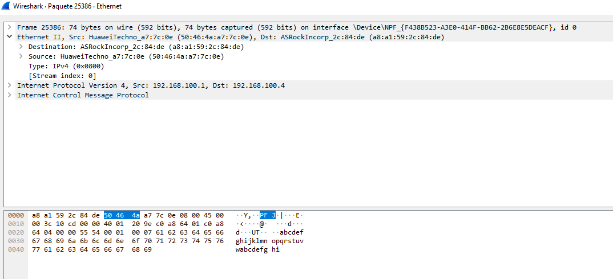
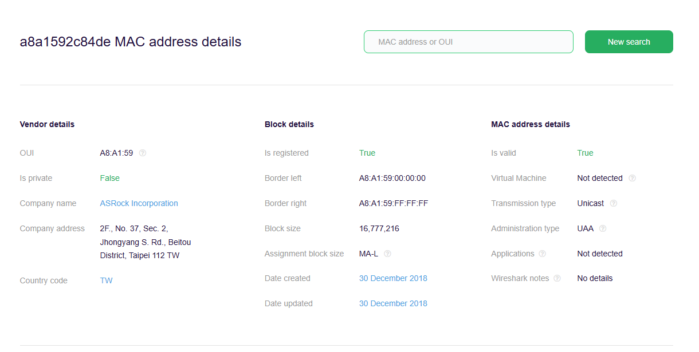
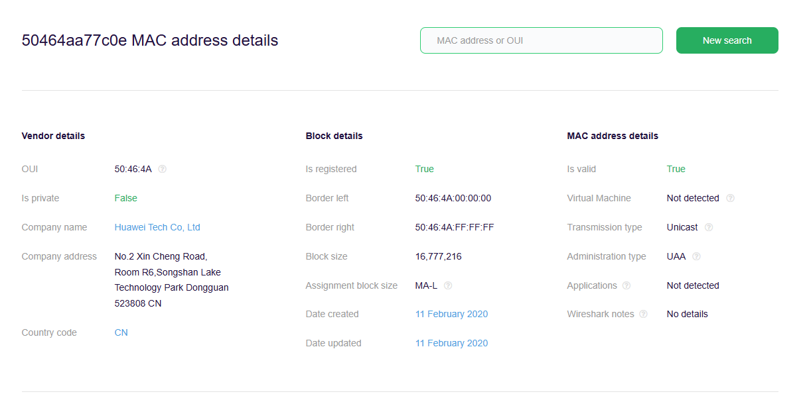
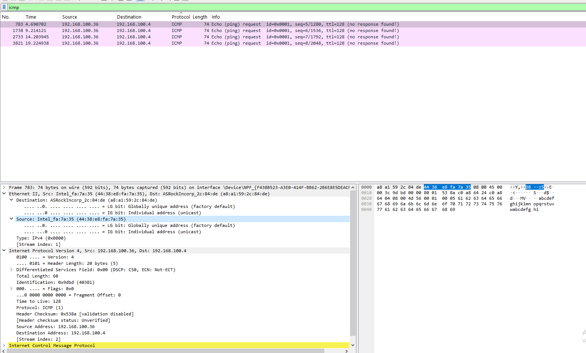
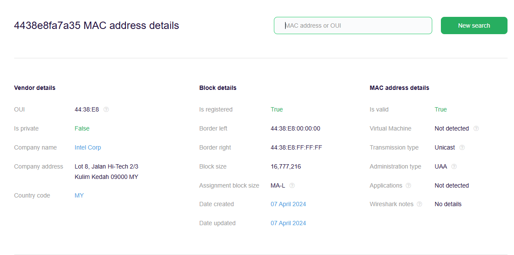

# Universidad Nacional de Córdoba

## Facultad de Ciencias Exactas, Físicas y Naturales

### Ingeniería en Computación

---

# Informe TP1 - Comunicaciones de Datos

**Materia:** Comunicaciones de Datos  
**Trabajo Práctico N°:** 1

**Alumnos:** Mateo Bernardi - Santiago Madrid  
**Año:** 2025  
**Profesor:** Ing. Facundo Oliva Cuneo - Ing. Santiago Henn
**Fecha de entrega:** 25/08/2025

---

## Actividad 1

1. La imagen describe lo que se llama como efecto Doppler. El cambio de la frecuencia observada por el movimiento relativo entre la fuente (satélite) y el receptor (barco).

2. Los sistemas que más se ven afectados son aquellos que son inalámbricos, como por ejemplo el WiFi. Por otro lado, los menos afectadas son aquellos que están cableadas como el coaxial o la fibra óptica.

3. Las razones por las que no se debe encender el móvil arriba de un avión tienen que ver con la interferencia electromagnética con los dispositivos propios del mismo que se puede dar por muchos dispositivos juntos en el mismo lugar. Dicho esto, hay que destacar que el riesgo real es muy bajo, sin embargo los organismos de aviación adoptan una política de riesgo cero.

## Actividad 2

1. El fenómeno descrito en la imagen es el de ruido e interferencia en una onda, que provoca el desplazamiento de las ondas.
   Se caracteriza por su forma origen, espectro, potencia, comportamiento temporal y forma de afectar la señal.

2. El ruido o interferencia afecta más a aquellos sistemas que trabajan con una transmisión analógica, de banda angosta como por ejemplo, FM. Por otro lado, las menos afectadas son aquellas que trabajan de modo digital con corección de errores.

3. La SNR es la sensibilidad al ruido, se decribe como la relación entre la potencia de la señal y la potencia del ruido. Se suele expresar en dB.

$$
SNR = (Pseñal/Pruido)
$$

$$
SNR_{dB} = 10*(log(Pseñal/Pruido))
$$

Está directamente relacionado con el BER de forma que a mayor SNR, menor BER.

## Actividad 3

a)
El protocolo ethernet, estandarizado bajo la normativa IEEE 802.3, es una tecnologia que define como los dispositivos enivan y reciben datos dentro de una LAN (Local Area Network) o de una WAN (Wide Area Network).
Su objetivo es que los dispositivos puedan comunicarse entre si sin interferirse.

Sus características principales son:

- Comunicación en tramas.
- Usa direcciones MAC de 48 bits (6 bytes).
- Topología en estrella con switches.
- Soporta distintas velocidades (10 Mbps, 100 Mbps, 1 Gbps, 10 Gbps+).
- Método de acceso: CSMA/CD (casi en desuso por switches).

Formato de una trama Ethernet:

| Campo              | Tamaño        | Función                                                    |
| ------------------ | ------------- | ---------------------------------------------------------- |
| **Preamble + SFD** | 8 bytes       | Sincronización. Secuencia que indica el inicio de la trama |
| **MAC destino**    | 6 bytes       | Direccion del receptor                                     |
| **MAC origen**     | 6 bytes       | Direccion del emisor                                       |
| **Tipo/Longitud**  | 2 bytes       | Protocolo de capa superior (ej: IPv4 = 0x0800)             |
| **Datos**          | 46–1500 bytes | Payload                                                    |
| **FCS**            | 4 bytes       | Verificación de errores                                    |
| **IFS**            | -             | Espacio entre tramas                                       |

Diferencias:

- Ethernet (10BASE-T): 10 Mbps.
- Fast Ethernet (100BASE-TX): 100 Mbps. Utiliza 2 pares de cables para sus conexiones.
- Gigabit Ethernet (1000BASE-T): 1 Gbps. Utiliza 4 pares de cables, lo que permite una mayor capacidad de transmisión.

Ventajas de Ethernet:

- **Alta velocidad de datos y baja latencia.**
  Ofrece baja latencia y velocidades de transmision de datos muy elevadas incluso para grandes archivos.
- **Conexion estable y resistencia a interferencias.**
  Al ser cableados, son muy resistentes a interferencias externas y aseguran que los datos lleguen a destino.
- **Seguridad.**
  Una conexión física limita el riesgo de accesos no autorizados en comparación con las conexiones inalámbricas, mejorando la seguridad de la red.
- **Costo bajo y escalabilidad.**
  Ethernet es relativamente economica de implementar si la comparamos con otras opciones de red. Ademas es compatible con una gran variedad de dispositivos, lo que facilita la escalabilidad de la red.

b)

_Cable UTP (Unshielded Twisted Pair)_:
UTP es un cable de cobre con pares trenzados, usado en Ethernet para la transmision de informacion en redes LAN. Este no tiene ninguna proteccion adicional (a diferencia de STP).

_Relación con ítem 2_:
El trenzado está pensado para minimizar ruido electromagnético y mejorar la integridad de señal.

_Diferencias entre cables_:
**Derecho (Straight-Through)**: ambos extremos con el mismo orden de colores. Se usa PC ↔ Switch/Router.
**Cruzado (Crossover)**: invierte TX y RX en un extremo. Se usa PC ↔ PC o Switch ↔ Switch directamente.

c)

Para este apartado hemos utilizado la herramienta WireShark para testear y probar la transmision de datos entre diferentes dispositivos en la misma red.

Para comenzar se utilizo el comando **ipconfig** para obtener la informacion de ip propia y puerta de enlace

- **Direccion IPv4**: 192.168.100.4
- **Puerta de enlace predeterminada**: 192.168.100.1

A continuación se envia un **ping** a la puera de enlace para rastrear y analizar un paquete con WireShark.
Se utilizo una PC de Escritorio conectada al Router por medio de un cable Ethernet UTP.

 

En esta imagen se filtraron los paquetes **icmp** para obtener los enviados y recibidos a traves del ping.
Se puede observar que la conexion se pudo testear correctamente.

Si analizamos con mayor profundidad un paquete concreto, podemos obtener la siguiente informacion

###### Detalle de la trama
- Ethernet II: dirección MAC de origen y destino. El programa nos brinda las empresas fabricantes de cada dispositivo:
  - Origen: HuaweiTechno
  - Destino: ASRockIncorp
- IPv4: dirección IP del dispositivo de origen y destino.
  - Origen: 192.168.100.1
  - Destino: 192.168.100.4
- Internet Control Message Protocol: Contiene el tiempo de respuesta y las primeras letras del abecedario como datos.
- HexDump: Se trata de toda la informacion detallada anteriormente pero en formato hexadecimal, tal y como viaja por el cable de red.

d)

Con la dirección de MAC obtenida con el ping anteriormente, podemos obtener informacion sobre el fabricante en paginas como https://macaddress.io/mac-address-lookup. 
Esto fue lo que pudimos obtener:

Dirección MAC de destino. PC de escritorio.

Fecha de creación: 30 de diciembre de 2018
Fabricante: ASRock Incorporation.
Direccion de la compañia: 2F., No. 37, Sec. 2, Jhongyang S. Rd., Beitou District, Taipei 112 TW.

Dirección MAC de origen. Router Huawei.

Fecha de creación: 11 de febrero de 2020
Fabricante: Huawei Tech Co.
Dirección de la compañia: No. 2 Xin Cheng Road, Room R6, Songshan Lake Technology Park Dongguan 523808, China.

e)

Para este apartado hemos conectado otro dispositivo a la misma red, en este caso una Notebook a traves de WiFi.
Como prueba enviamos un ping desde el nuevo dispositivo, con IPv4 local 192.168.100.36, a la PC de Escritorio con IPv4 192.168.100.4 .
Luego procedemos de igual manera con WireShark para analizar los paquetes recibidos.

En este caso el paquete llega a nuestro dispositivo conectado por cable, pero no puede enviar la respuesta.
Tras intentos de realizar la conexion de forma inversa, no pudimos lograrlo.

A pesar de esto, podemos analizar los paquetes recibidos en el primer dispositivo y extraer la siguiente información:

###### Detalle de la trama
- Ethernet II: dirección MAC de origen y destino. El programa nos brinda las empresas fabricantes de cada dispositivo:
  - Origen: Intel
  - Destino: ASRockIncorp
- IPv4: dirección IP del dispositivo de origen y destino.
  - Origen: 192.168.100.36
  - Destino: 192.168.100.4
- Internet Control Message Protocol: Contiene el tiempo de respuesta y las primeras letras del abecedario como datos.
- HexDump: Se trata de toda la informacion detallada anteriormente pero en formato hexadecimal, tal y como viaja por el cable de red.

Con la nueva direccion MAC podemos obtener informacion del fabricante del nuevo dispositivo conectado en la red.

Fecha de creación: 07 de abril de 2024
Fabricante: Intel Corp
Dirección de la compañia: Lot 8, Jalan Hi-Tech 2/3 Kulim Kedah 09000, Malasia.

4) 
### Reflexiones finales y conclusiones

Durante el trabajo práctico pudimos observar que cada dispositivo conectado a la red deja información visible, principalmente mediante su dirección MAC y su dirección IP. Esto permite identificar los dispositivos y obtener datos como el fabricante, como vimos al analizar la PC de escritorio, la notebook y el router Huawei. Por eso, se puede decir que la privacidad dentro de una red local no es completa, y la dirección MAC permite la trazabilidad de un equipo.

La dirección MAC cumple un rol similar al IMEI de un teléfono móvil, ya que ambos son identificadores únicos del dispositivo. La MAC identifica la interfaz de red, mientras que el IMEI identifica el teléfono dentro de la red celular. Ambos pueden usarse para rastrear y reconocer un equipo.

Respecto a las VPN, estas permiten ocultar la dirección IP pública y cifrar el tráfico frente a internet, pero no ocultan la dirección MAC dentro de la red local. Esto significa que otros dispositivos en la misma LAN todavía pueden detectar y reconocer el hardware del equipo.

En conclusión, el TP nos permitió entender cómo funciona la trazabilidad a nivel de hardware, así como el funcionamiento de las tramas y las direcciones MAC. Estos conceptos son clave para comprender la seguridad en redes locales.