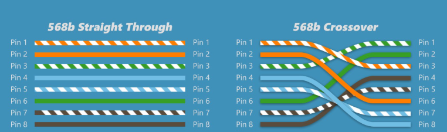

# Universidad Nacional de Córdoba

## Facultad de Ciencias Exactas, Físicas y Naturales

### Ingeniería en Computación

---

# Informe TP1 - Comunicaciones de Datos

**Materia:** Comunicaciones de Datos  
**Trabajo Práctico N°:** 1

**Alumnos:** Mateo Bernardi - Santiago Madrid  
**Año:** 2025  
**Profesor:** Ing. Facundo Oliva Cuneo - Ing. Santiago Henn
**Fecha de entrega:** 25/08/2025

---

## Actividad 1
1. La imagen describe lo que se llama como efecto Doppler. El cambio de la frecuencia observada por el movimiento relativo entre la fuente (satélite) y el receptor (barco).

2. Los sistemas que más se ven afectados son aquellos que son inalámbricos, como por ejemplo el WiFi. Por otro lado, los menos afectadas son aquellos que están cableadas como el coaxial o la fibra óptica.

3. Las razones por las que no se debe encender el móvil arriba de un avión tienen que ver con la interferencia electromagnética con los dispositivos propios del mismo que se puede dar por muchos dispositivos juntos en el mismo lugar. Dicho esto, hay que destacar que el riesgo real es muy bajo, sin embargo los organismos de aviación adoptan una política de riesgo cero.

## Actividad 2
1. El fenómeno descrito en la imagen es el de ruido e interferencia en una onda, que provoca el desplazamiento de las ondas.
Se caracteriza por su forma origen, espectro, potencia, comportamiento temporal y forma de afectar la señal.

2. El ruido o interferencia afecta más a aquellos sistemas que trabajan con una transmisión analógica, de banda angosta como por ejemplo, FM. Por otro lado, las menos afectadas son aquellas que trabajan de modo digital con corección de errores.

3. La SNR es la sensibilidad al ruido, se decribe como la relación entre la potencia de la señal y la potencia del ruido. Se suele expresar en dB.

$$
SNR = (Pseñal/Pruido)
$$
$$
SNR_{dB} = 10*(log(Pseñal/Pruido))
$$

Está directamente relacionado con el BER de forma que a mayor SNR, menor BER.

## Actividad 3

a)
El protocolo ethernet, estandarizado bajo la normativa IEEE 802.3, es una tecnologia que define como los dispositivos enivan y reciben datos dentro de una LAN (Local Area Network) o de una WAN (Wide Area Network). 
Su objetivo es que los dispositivos puedan comunicarse entre si sin interferirse.

Sus características principales son:
- Comunicación en tramas.
- Usa direcciones MAC de 48 bits (6 bytes).
- Topología en estrella con switches.
- Soporta distintas velocidades (10 Mbps, 100 Mbps, 1 Gbps, 10 Gbps+).
- Método de acceso: CSMA/CD (casi en desuso por switches).

Formato de una trama Ethernet:

| Campo              | Tamaño        | Función                                                   |
| ------------------ | ------------- | --------------------------------------------------------- |
| **Preamble + SFD** | 8 bytes       | Sincronización. Secuencia que indica el inicio de la trama|
| **MAC destino**    | 6 bytes       | Direccion del receptor                                    |
| **MAC origen**     | 6 bytes       | Direccion del emisor                                      |
| **Tipo/Longitud**  | 2 bytes       | Protocolo de capa superior (ej: IPv4 = 0x0800)            |
| **Datos**          | 46–1500 bytes | Payload                                                   |
| **FCS**            | 4 bytes       | Verificación de errores                                   |
| **IFS**            | -             | Espacio entre tramas                                      |

Diferencias:
- Ethernet (10BASE-T): 10 Mbps.
- Fast Ethernet (100BASE-TX): 100 Mbps. Utiliza 2 pares de cables para sus conexiones.
- Gigabit Ethernet (1000BASE-T): 1 Gbps. Utiliza 4 pares de cables, lo que permite una mayor capacidad de transmisión.

Ventajas de Ethernet:

- **Alta velocidad de datos y baja latencia.**
Ofrece baja latencia y velocidades de transmision de datos muy elevadas incluso para grandes archivos. 
- **Conexion estable y resistencia a interferencias.**
Al ser cableados, son muy resistentes a interferencias externas y aseguran que los datos lleguen a destino.
- **Seguridad.**
Una conexión física limita el riesgo de accesos no autorizados en comparación con las conexiones inalámbricas, mejorando la seguridad de la red.
- **Costo bajo y escalabilidad.**
Ethernet es relativamente economica de implementar si la comparamos con otras opciones de red. Ademas es compatible con una gran variedad de dispositivos, lo que facilita la escalabilidad de la red.

b)

_Cable UTP (Unshielded Twisted Pair)_:
UTP es un cable de cobre con pares trenzados, usado en Ethernet para la transmision de informacion en redes LAN. Este no tiene ninguna proteccion adicional (a diferencia de STP).

_Relación con ítem 2_:
El trenzado está pensado para minimizar ruido electromagnético y mejorar la integridad de señal.

_Diferencias entre cables_:
**Derecho (Straight-Through)**: ambos extremos con el mismo orden de colores. Se usa PC ↔ Switch/Router.
**Cruzado (Crossover)**: invierte TX y RX en un extremo. Se usa PC ↔ PC o Switch ↔ Switch directamente.

c) 
