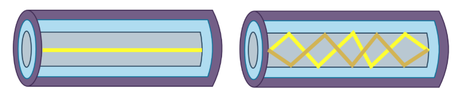
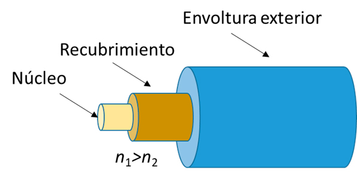
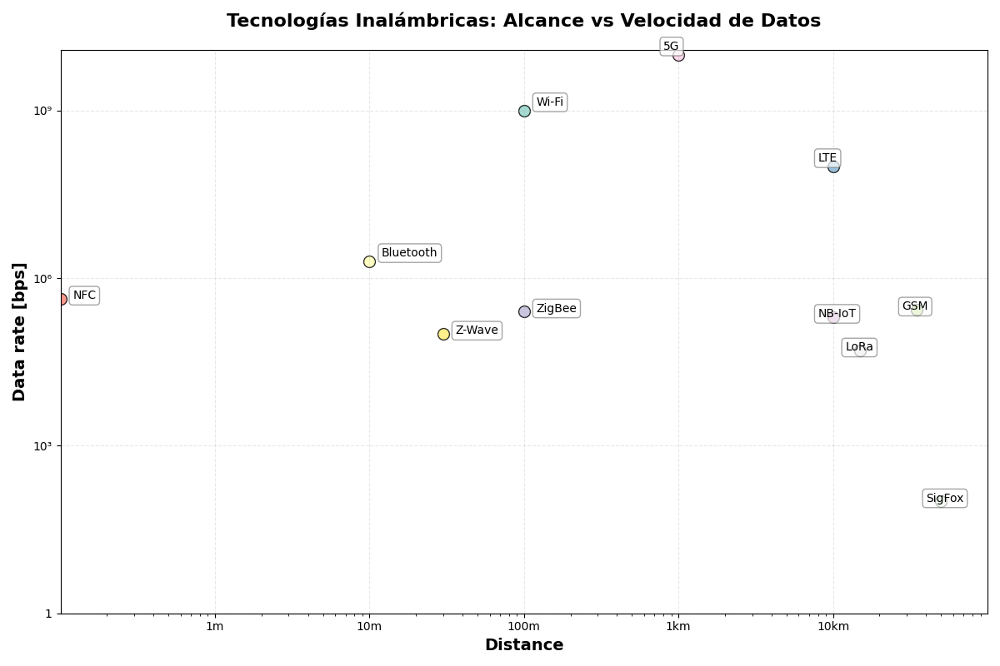

# Universidad Nacional de Córdoba

## Facultad de Ciencias Exactas, Físicas y Naturales

### Ingeniería en Computación

---

# Informe TP1 - Comunicaciones de Datos

**Materia:** Comunicaciones de Datos  
**Trabajo Práctico N°:** 3

**Alumnos:** Mateo Bernardi - Santiago Madrid  
**Año:** 2025  
**Profesor:** Ing. Facundo Oliva Cuneo - Ing. Santiago Henn
**Fecha de entrega:** 22/09/2025

---

## Actividad 1
1- Ethernet es una tecnología para redes de datos por cable surgida a principios de los años 70, como sistema interno de la empresa Xerox, y que luego se estandarizó en los años 80. **IEEE 802.3** es el protocolo actual más extendido para su uso, sustentando prácticamente todas las redes LAN modernas.
**IEEE 802.11** introducido en 1997 por el IEEE, engloba varias normas WLAN (wireless) utilizadas en la mayoría de los dispositivos con capacidad de transmisión. Las mismas definen la capa física en una red inalámbrica local y permiten el acceso a dicha capa. Hoy en día es el estándar detrás del Wi-Fi. 

2- 

3- Si una red Wi-Fi opera con un protocolo específico, y un dispositivo utiliza una NIC que no soporta dicho protocolo, el dispositivo no podrá conectarse a la red Wi-Fi. La compatibilidad entre el protocolo de la red y las capacidades de la NIC del dispositivo es necesaria para establecer una conexión exitosa.

4- Cada evolución de protocolo viene con nuevas exigencias de seguridad. Esto se debe a que al traer más velocidad también trae más modos de transmisión, más usuarios simultáneos, nuevas frecuencias. Todo esto multiplica las formas en las que alguien podría intentar atacar vulnerabilidades, lo que obliga a exigencias de autenticación, cifrado, y validación de datos más fuertes.

5- 
|                    | Wi-Fi 5       | Wi-Fi 6        | Wi-Fi 7        |
| ------------------ | ------------- | ---------------|----------------|
| **Versión IEEE**   | IEEE 802.11ac | IEEE 802.11ax  | IEEE 802.11be  | 
| **Tasa datos max** | ~3.5 Gbps     | ~9.6 Gbps      | ~46 Gbps       | 
| **Banda(s)**       | 5 GHz         | 2.4 GHz, 5 GHz | 2.4, 5, 6 GHz  | 
| **Ancho de banda** | Hasta 160 MHz | Hasta 160 MHz  | Hasta 320 MHz  | 
| **Modulación**     | 256 QAM       | Hasta 1024 QAM | Hasta 4096 QAM | 
| **Sistema de seg** | WPA2          | WPA3           | WPA3           | 
|--------------------|---------------|----------------|----------------|

## Actividad 2
En esta actividad se responden preguntas sobre las transmisiones en Fibra Óptica.
a) 
En la siguiente imagen se pueden observar dos diferentes tipos de transmision por fibra óptica.

En la primera ilustracion vemos un segmento de fibra usada en **monomodo**, mientras que la segunda la muestra en su aplicacion de **multimodo**. 
Estas son dos formas de transmision via Fibra Optica y tienen diferentes características.

##### Fibra monomodo (Single Mode Fiber):
- Se envía informacion de forma unidireccional y la luz viaja practicamente en línea recta.
- Nucleo de vidrio con diametro de 9 micrones.
- Revestimiento de vidrio con diametro de 125 micrones.
- Permite su implementacion en situaciones de larga distancia, hasta cientos de kilometros. 
- Se utilizan laser para enviar la luz con precisión.
- Aplicación: Telefonia de larga distancia, television por cable, etc.

##### Fibra multimodo (Multimode Fiber):
- Se envía informacion con la luz ingresando en diferentes angulos a la fibra.
- Nucleo de vidrio con diametro de 50/62,5 micrones.
- Revestimiento de vidrio con diametro de 125 micrones.
- Permite su implementacion en distancias hasta 500 mts.
- Se pueden utilizar emisores LED, reduciendo su costo.
- Aplicación: Redes LAN, datacenters, etc.

b)
##### Ley de Snell: 
La ley de Snell describe el cambio de direccion de la luz al pasar de un medio a otro, cuando el indice de refraccion **n** es distinto.

$$n1​⋅sin(θ1​)=n2​⋅sin(θ2​)$$

donde:

- \( n_1, n_2 \) = índices de refracción de los dos medios.  
- \( \theta_1 \) = ángulo de incidencia (respecto a la normal).  
- \( \theta_2 \) = ángulo de refracción.  

Cuando hablamos de Fibra Óptica, esta ley nos explica la diferencia central entre fibra Monomodo y Multimodo.

El cableado de Fibra Óptica esta compuesto por 3 partes fundamentales:

- Núcleo: Se trata de vidrio con un indice de refraccion \( n_1 \)
- Recubrimiento: Se trata de vidrio con un indice de refraccion de \( n_2 \).
- Envoltura exterior

En cuanto a los diferentes tipos de fibra, el diametro de nucleo es la principal diferencia. 
En el caso de la fibra monomodo, se usa laser de precision y la luz rebota en el recubrimiento de manera muy limitada y controlada.
Por otro lado, la fibra multimodo usa el recubrimiento para enviar luz rebotando en diferentes angulos y asi poder bajar los costos al no utilizar fuentes de luz de precision.

El problema con que la luz rebote muchas veces con el recubrimiento es que a mayor distancia recorrida, mayor es la **dispersion modal**.

La dispersion modal es el fenomeno por el cual los diferentes pulsos que entran en la fibra multimodo recorren diferentes distancias debido a los diferentes angulos en los que rebotan con el recubrimiento.

En largas distancias, esto puede generar perdida de información, ya que no se puede asegurar que los pulsos de luz lleguen en el orden en el que fueron enviados.

c)
##### Relación entre conexiones inalámbricas y por fibra optica

- **Uso de la luz o señales electromagnéticas:** La fibra óptica transmite luz visible o infrarroja a través del núcleo de vidrio o plástico. Las conexiones inalámbricas transmiten ondas electromagnéticas por el aire.

En ambos casos, la información viaja en forma de señales electromagnéticas moduladas para transportar datos.

- **Velocidad de transmisión alta:** Ambas tecnologías permiten transferencias rápidas de datos.

La fibra óptica es generalmente más rápida y estable, pero las conexiones inalámbricas también alcanzan velocidades considerables con las nuevas generaciones (5G, Wi-Fi 6/7).

- **Dependencia de la propagación**:
    - En fibra óptica: la luz debe permanecer confinada en el núcleo mediante reflexión interna total (Ley de Snell).
    - En inalámbrico: las ondas deben propagarse sin demasiadas interferencias, reflexiones o pérdidas de señal.

## Actividad 3
a)
| Protocolo          | Estandarizado | Estándar (última versión)       |
| ------------------ | ------------- | --------------------------------|
| *Wi-FI*          | Sí            | IEEE 802.11(ax,be)              | 
| *Bluetooth*      | Sí            | IEEE 802.1.15                   | 
| *ZigBee*         | Sí            | IEEE 802.15.4                   | 
| *NFC*            | Sí            | ISO/IEC 18092:2019              | 
| *LTE*            | Sí            | 3GPP                            | 
| *GSM*            | Sí            | EDGE                            | 
| *5G (#GPP)*      | Sí            | 3GPP                            |
| *LoRa*           | Parcialmente  | LoRaWAN 1.0.4 (sólo protocolo)  | 
| *NB-IoT*         | Sí            | 3GPP                            | 
| *SigFox*         | No            | x                               | 
| *Z-Ware*         | Sí            | ITU-T G.9959                    |

b)

c)

|Características     |UTP           |Fibra Óptica  |Wi-Fi 802.11be |Bluetooth 5.4 |5G           |
|--------------------|--------------|--------------|---------------|--------------|-------------|
|Ancho de Banda      |Hasta 10 Gbps |Hasta 400 Gbps|Hasta 46 Gbps  |Hasta 2 Mbps  |Hasta 20 Gbps|
|Distancias          |Hasta 100m    |Hasta 200km (SMF)|Hasta 70m   |Hasta 240m    |Hasta 100km  |
|Inmunidad a EMI/RFI |Baja          |Muy alta      |Moderada       |Moderada/ Baja|Moderada     |
|Costos de medios    |Bajo          |Alto          |Moderado       |Muy bajo      |Alto         |
|¿Disponible en PT?  |Si            |Si            |No             |No            |No           |

## Actividad 4

a)

Estas son las tecnologias que permiten que hoy en dia se puedan conectar a WiFi los pasajeros de un avion:
1. **Air-to-Ground (A2G)**

Esta tecnología utiliza torres de telefonía móvil terrestres con antenas orientadas hacia arriba y una antena en la parte inferior del avión para establecer una conexión directa con la red terrestre.

##### Características:

* Baja latencia: La comunicación directa con la red terrestre reduce la latencia, ofreciendo una experiencia más fluida para los usuarios.

* Alta capacidad por área: A2G puede proporcionar una mayor capacidad de datos por kilómetro cuadrado en comparación con los sistemas satelitales, especialmente en áreas densamente pobladas. 
Thales

##### Limitaciones:

* Cobertura limitada: Solo es efectiva en áreas con infraestructura de torres terrestres, lo que excluye océanos y regiones remotas. 
AN Aviation Services Co.

* Dependencia de la línea de vista: Obstáculos como montañas o edificios altos pueden interrumpir la señal.

* Capacidad limitada en rutas internacionales: Su uso se restringe principalmente a vuelos nacionales o regionales.

2. **Conectividad Satelital**

Los aviones se conectan a satélites en órbita, que luego transmiten la señal a estaciones terrestres.

##### Características:

* Cobertura global: Ideal para vuelos transatlánticos o sobre océanos, donde no hay infraestructura terrestre disponible.

* Alta capacidad de datos: Sistemas como ViaSat-3 ofrecen velocidades de hasta 1 Gbps, permitiendo streaming y videollamadas de alta calidad. 

* Tecnología avanzada: La constelación Starlink de SpaceX, por ejemplo, utiliza satélites de órbita baja para ofrecer baja latencia y alta velocidad.

##### Limitaciones:

* Mayor latencia: La señal debe viajar al espacio y regresar, lo que introduce una mayor latencia en comparación con A2G.

* Costo elevado: La instalación y mantenimiento de equipos satelitales en aviones es costosa.

* Interferencia climática: Condiciones meteorológicas adversas pueden afectar la calidad de la señal.

b)

c)
