# Universidad Nacional de Córdoba

## Facultad de Ciencias Exactas, Físicas y Naturales

### Ingeniería en Computación

---

# Informe TP1 - Comunicaciones de Datos

**Materia:** Comunicaciones de Datos  
**Trabajo Práctico N°:** 4

**Alumnos:** Mateo Bernardi - Santiago Madrid  
**Año:** 2025  
**Profesor:** Ing. Facundo Oliva Cuneo - Ing. Santiago Henn
**Fecha de entrega:** 25/08/2025

---

## Actividad 1

1. Según el alcance las redes se pueden clasificar en:
    - Red de área personal (PAN), hablamos de una red de pocos metros, sirven para conectar dispositivos personales. Bajo consumo de energía.
    - Red de área local (LAN), es la que suele instalarse en la mayoría de las empresas. Alta velocidad, generalmente cableada o Wi-Fi.
    - Red de área de campus (CAN), varias redes de área local instaladas en áreas específicas, pero a su vez todas ellas interconectadas,
    - Red de área metropolitana (MAN), abarcan espacios metropolitanos mucho más grandes. Usualmente operadores de telecomunicaciones la gestionan.
    - Red de área amplia (WAN), Conecta múltiples LAN y MAN a gran distancia. Uso de líneas dedicadas, satélite o internet.
    - Red de área de almacenamiento (SAN), Conecta servidores y sistemas de almacenamiento de datos. Optimizada para transferencia masiva y alta disponibilidad.

2. Una VLAN es una red lógica creada dentro de un mismo switch físico para segmentar el tráfico, divide los grupos de usuarios de la red de una red física real en segmentos de redes lógicas. Es posible configurar varios dispositivos lógicos VLAN en un solo sistema. Cada dispositivo lógico VLAN constituye una instancia adicional del adaptador Ethernet. Estos dispositivos lógicos pueden utilizarse para configurar las mismas interfaces IP de Ethernet que se utilizan con los adaptadores Ethernet físicos.
Se pueden clasificar en:
    - VLAN por puerto, cada puerto se asigna manualmente a una VLAN. Es la más común y simple.
    - VLAN dinámica, el switch asigna automáticamente un puerto a una VLAN según la MAC detectada, usando un servidor VMPS.
    - VLAN por protocolo, agrupa tráfico según protocolo, útil en entornos mixtos antiguos.
    - VLAN por dirección IP o subred, agrupa dispositivos dentro de una misma subred IP, aunque estén en distintos switches.
    - VLAN por usuario, el usuario pertenece a una VLAN sin importar dónde se conecte, usando autenticación.
    - VLAN nativa, es la VLAN no etiquetada (por defecto VLAN 1) que se usa para tráfico no marcado en enlaces troncales.

3. Es un estándar desarrollado por el grupo de trabajo 802 de la IEEE para permitir que múltiples redes compartan de forma transparente el mismo medio físico sin interferencias, mediante el mecanismo de trunking.
Este estándar define el protocolo de etiquetado de tramas en redes Ethernet, lo que permite el transporte de tráfico de múltiples VLAN a través de un solo enlace troncal.

4. Es el proceso de añadir una etiqueta o marca especial dentro del frame Ethernet para indicar a qué VLAN pertenece ese tráfico. Se usa entre switches, entre switch y router, siempre que se transporten múltiples VLAN por el mismo enlace físico. 
Permite a los switches distinguir a qué VLAN pertenece cada trama cuando viajan por un mismo enlace físico.

## Actividad 2

En esta actividad se implementa la siguiente topología en Packet Tracer
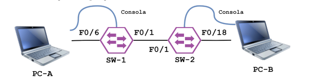

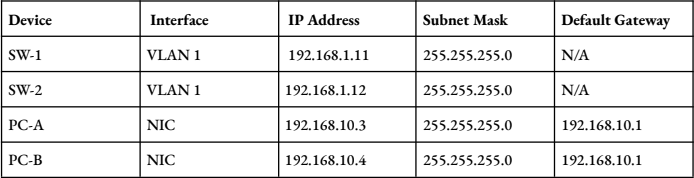

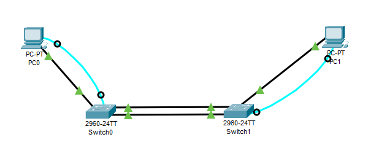

a) Nombrar los switch como sw1 y sw2.
- Se puso como contraseña de la consola: `contrasena_consola`.
- Se puso como contraseña de exec: `contrasena_exec`.
- Se utilizo `service password-encryption` para encriptar las contraseñas.

d) Se configuraron las VLAN segun la tabla de direcciones

e) Se desconectaron todas las interfaces que no estaban siendo utilizadas.

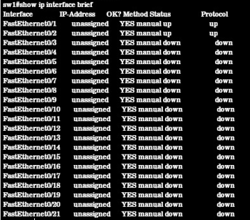

g) En este punto se testeó la comunicación haciendo ping entre computadoras.

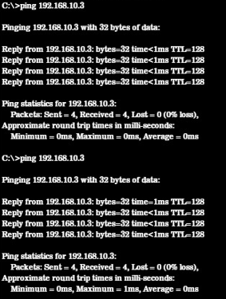

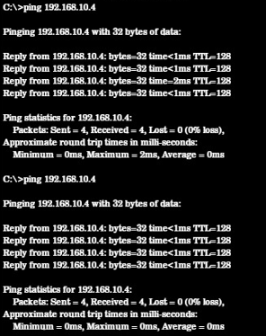

h) Se crearon VLAN en ambos switches.

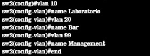

i) Visualizamos la lista de VLANs.

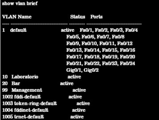
Por defecto se utiliza la VLAN `vlan 1`.

l) Verificar estado de la VLAN.

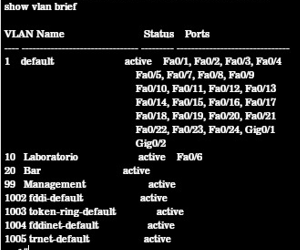

- VLAN 10 Lab: Tiene asignado el puerto Fa0/6

n) Verificar conexion entre PC-A y PC-B usando pings.

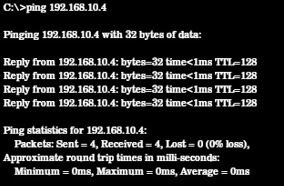 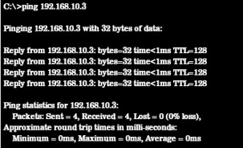

Conectividad entre pcs:
Las dos PCs pertenecen a la VLAN Laboratorio configurada en los switches.
Las PCs en la VLAN 10 se comunican correctamente entre sí a través de los dos switches. Se  confirma el correcto funcionamiento de la segmentación por VLAN y la conectividad de capa 2.

## Actividad 3

Utilizando lo que aprendimos sobre VLAN, e investigando la configuración de NAT y ACLs,
simularemos el despliegue de una red LAN a bordo de una aeronave. La idea es la siguiente, tendremos
tres segmentos:
i) Clase Turista: acceso solo a un sistema de entretenimiento (server local)
ii) Clase Business: acceso a sistema de entretenimiento e internet.
iii) Administración: acceso total.

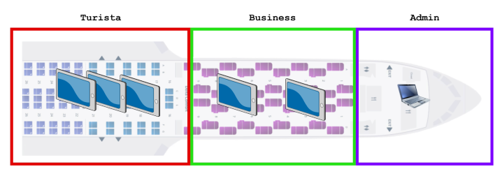

Topología:
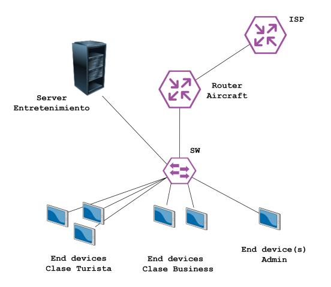

Y la siguiente tabla de direccionamiento:

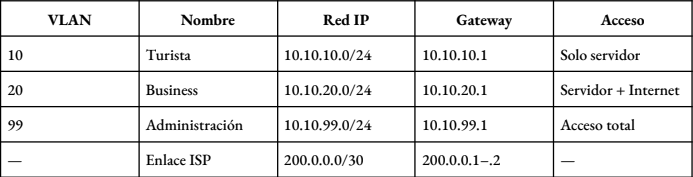

--- 
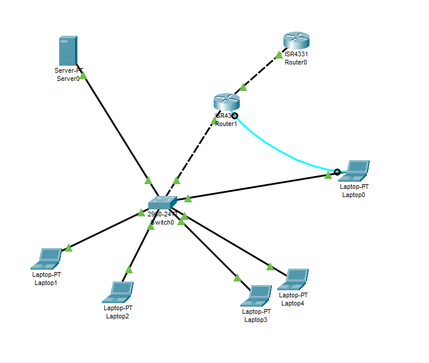

Pruebas

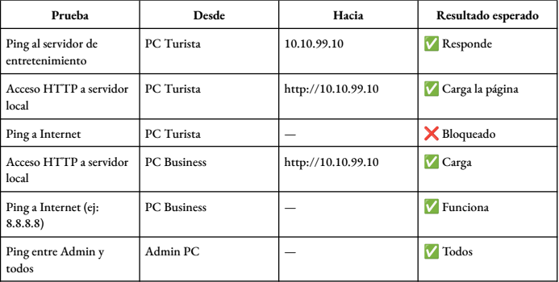

Ping al servidor de entretenimiento - De PC turista a 10.10.99.254

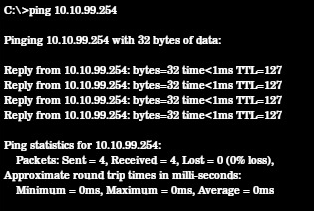

Acceso HTTP al servidor local 

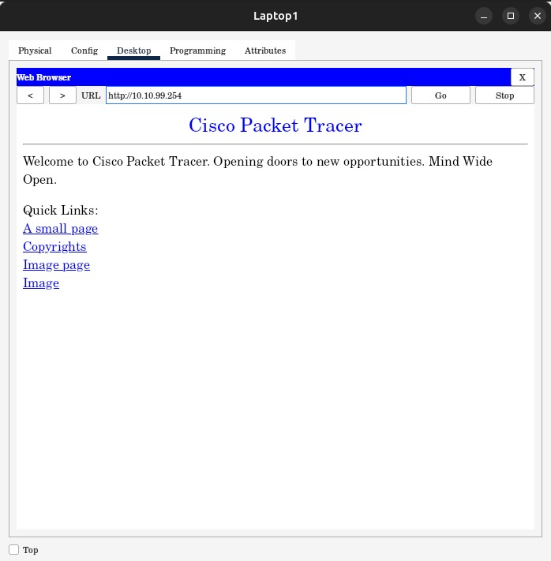

Ping a internet desde PC Turista

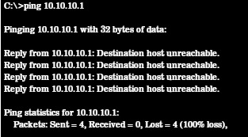

Acceso HTTP al servidor local - desde PC business

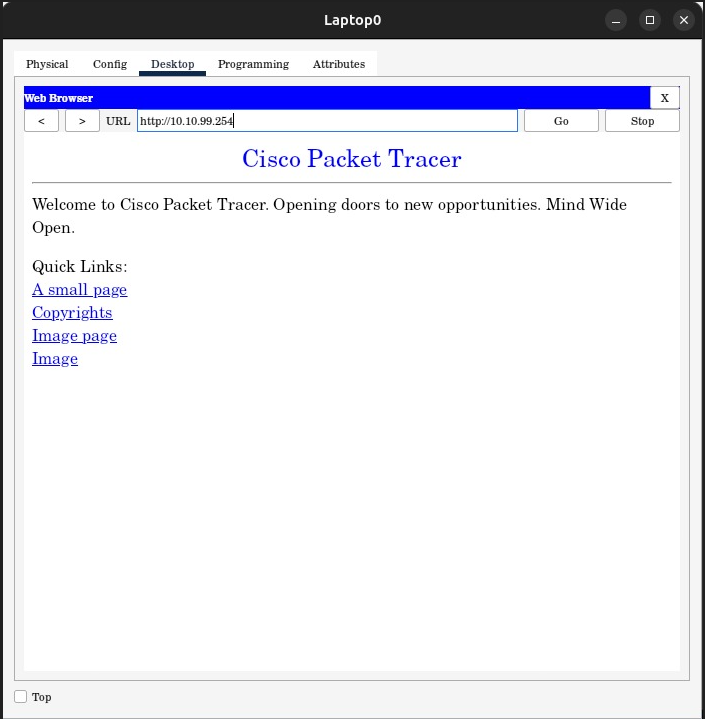

Ping a internet desde PC Business

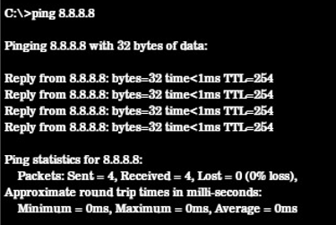

Ping entre admin y todos

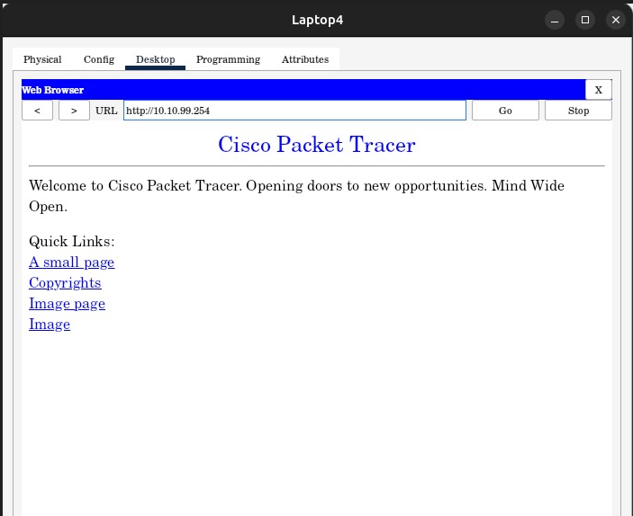
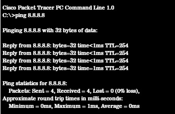
