# Universidad Nacional de Córdoba

## Facultad de Ciencias Exactas, Físicas y Naturales

### Ingeniería en Computación

---

# Informe - Comunicaciones de Datos

**Materia:** Comunicaciones de Datos  
**Trabajo Práctico N°:** 4

**Alumnos:** Mateo Bernardi - Santiago Madrid  
**Año:** 2025  
**Profesor:** Ing. Facundo Oliva Cuneo - Ing. Santiago Henn
**Fecha de entrega:** 25/08/2025

---

## Actividad 1

### Características del protocolo MQTT + Pub/Sub

MQTT (Message Queuing Telemetry Transport) es un protocolo de mensajeria liviano y eficiente. Permite su implementacion en microcontroladores pequeños, por los pocos recursos requeridos, y en redes con baja disponibilidad o alta latencia.
Su arquitectura se basa en comunicacion cliente-broker, y usa un patron publish/subscribe.

#### Características principales:
- Liviano: headers pequeños, ideal para IoT.
- Funciona sobre TCP.
- Implementa un patron publish/subscribe mediante un broker.
- QoS configurables entre 3 diferentes niveles: 0 (como mucho una vez), 1 (al menos una vez) y 2 (exactamente una vez).
- Topicos jerarquicos con uso de wildcards como "*" o "#".

#### Desventajas
- Dependencia total del broker.
- No tiene cifrado propio, necesita TLS.
- No es optimo para archivos grandes.
- No es optimo cuando se requieren latencias ultra bajas.
- Necesita redes con cierta estabilidad.

#### Usos principales
- Robotica en procesos de manufactura.
- IoT, tanto domótica como industrial.
- Automatización y monitoreo remoto.
- Sistemas distribuidos simples.

## Actividad 2
### Instalacion y despliegue de un broker MQTT

Para implementar el broker MQTT, se utilizó el servicio HiveMQ Cloud. El proceso consistió en:

1. **Registro en HiveMQ Cloud:** Se creó una cuenta en la plataforma para acceder a los servicios de broker en la nube.
2. **Creación de un cluster:** Se generó un nuevo cluster MQTT, lo que permite disponer de un broker dedicado y seguro en la nube.
3. **Configuración del cluster:** Se obtuvieron las credenciales de acceso (host, puerto, usuario y contraseña) necesarias para conectar clientes MQTT al broker.
4. **Gestión de usuarios:** Se configuraron los usuarios y permisos para controlar el acceso de los clientes al broker.
5. **Verificación de la conexión:** Se probaron las credenciales y la conectividad utilizando clientes MQTT (publisher y subscribers) desarrollados en Python, asegurando la comunicación exitosa entre los dispositivos y el broker.
6. **Monitoreo:** Se utilizó el panel de HiveMQ Cloud para visualizar la actividad del cluster, los mensajes transmitidos y los clientes conectados.

Este proceso permitió desplegar un entorno MQTT funcional y seguro, facilitando la comunicación entre dispositivos mediante el patrón publish/subscribe. 
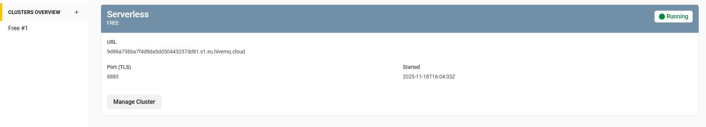
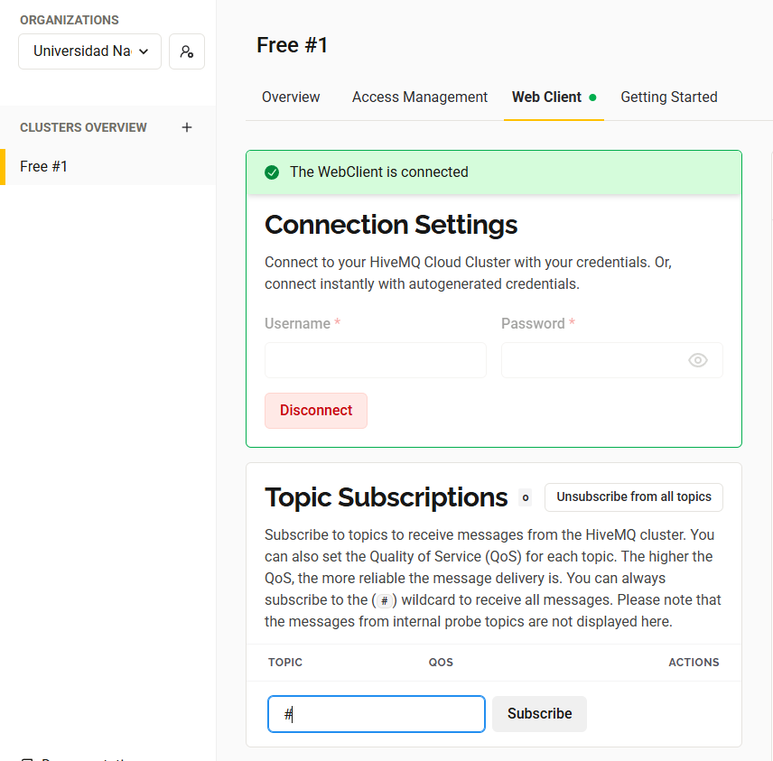
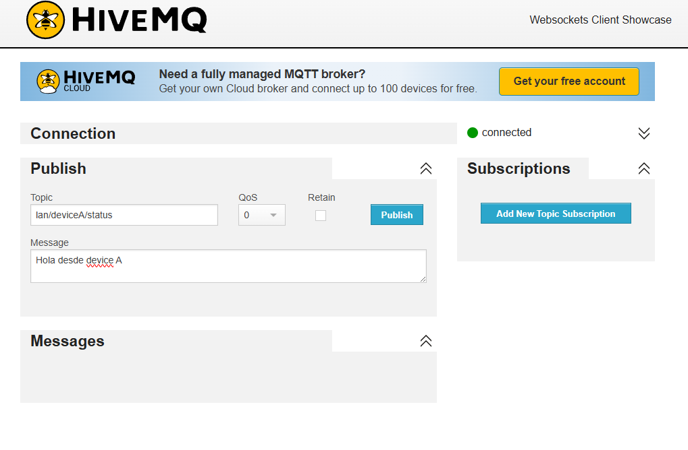
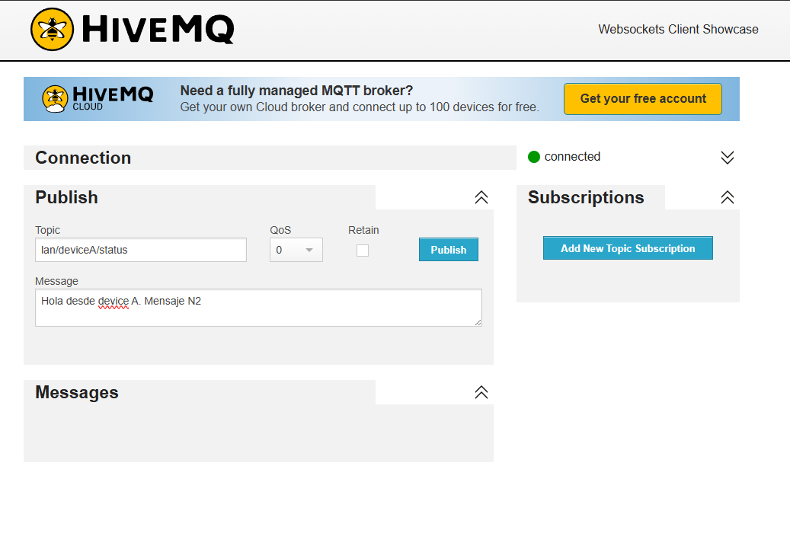
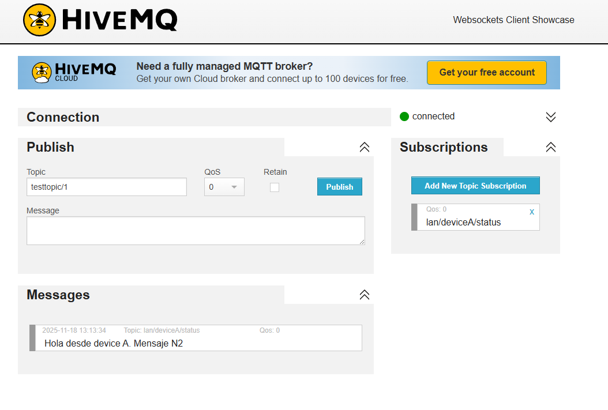
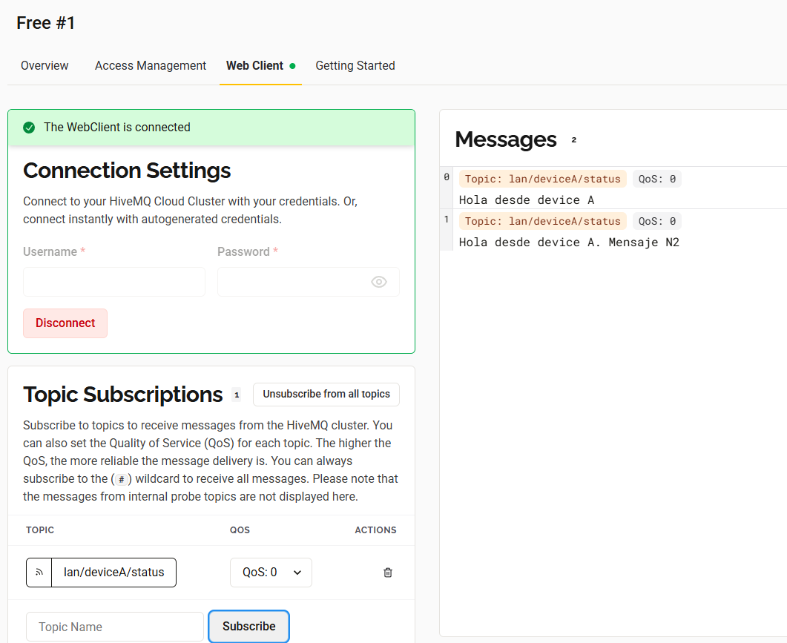

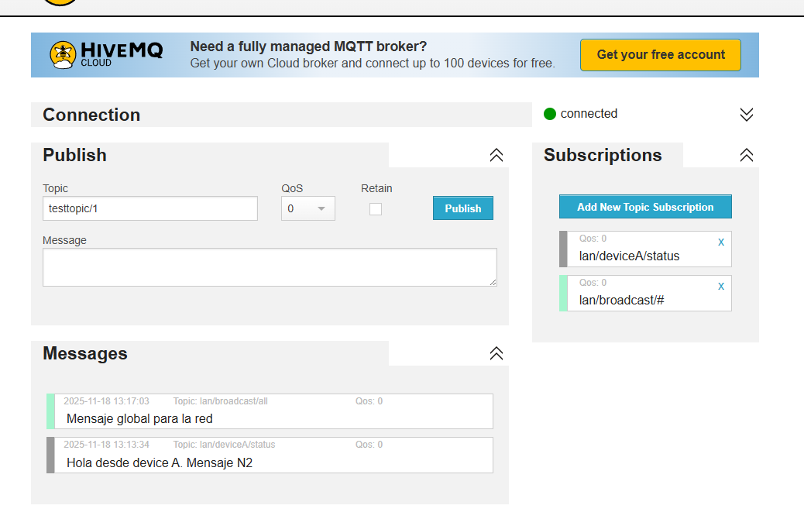
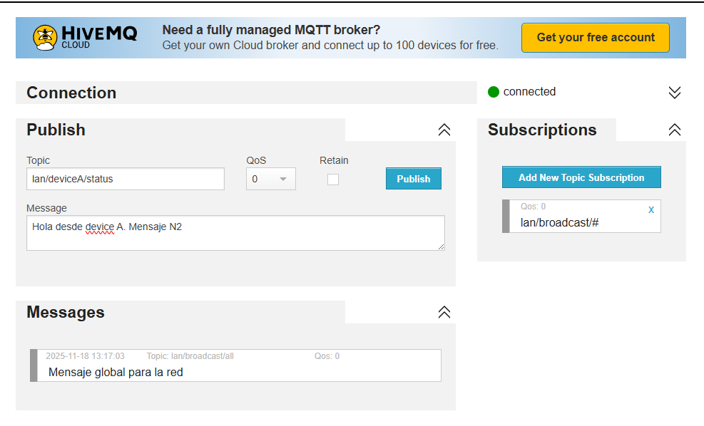
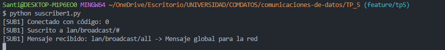

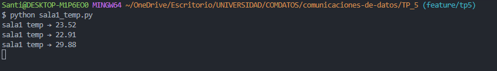
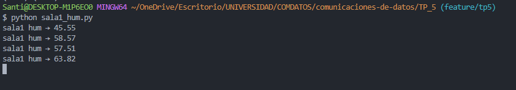
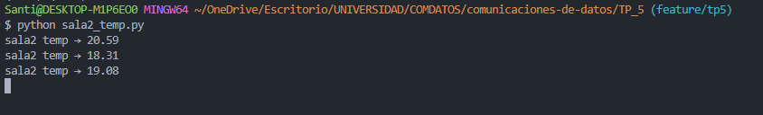
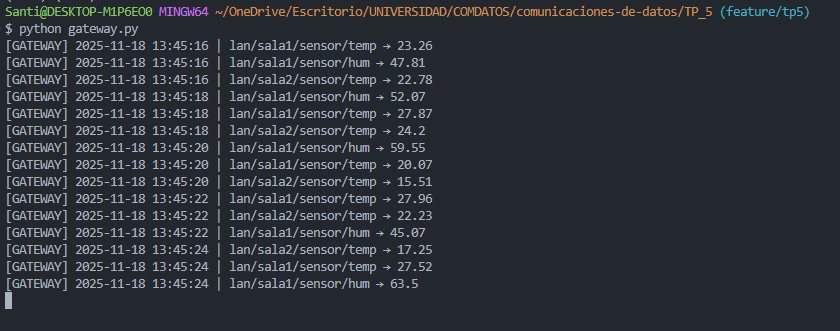
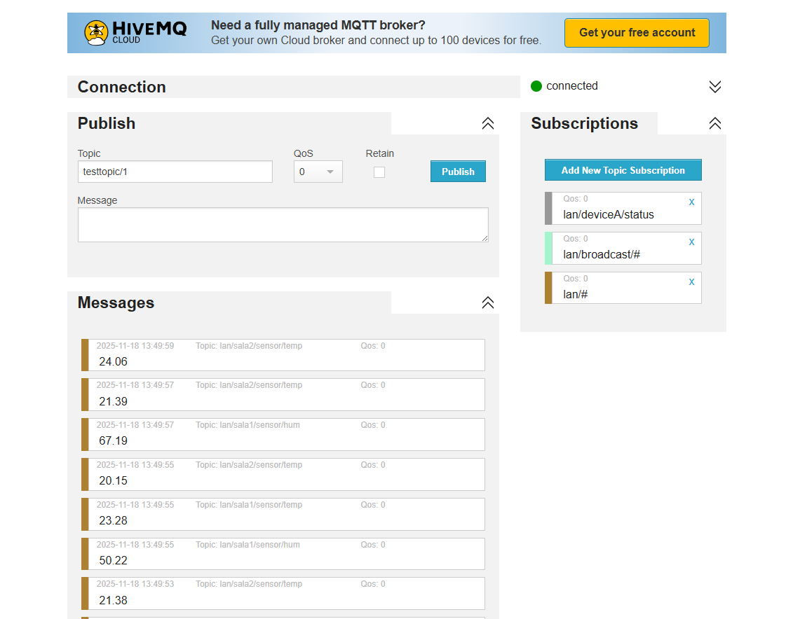

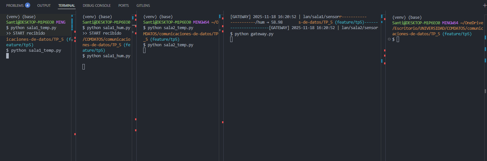
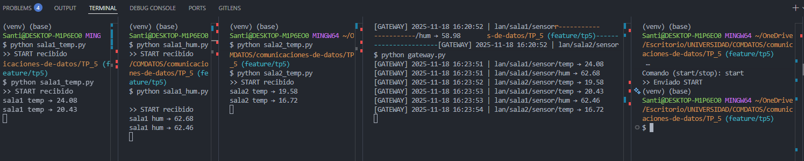
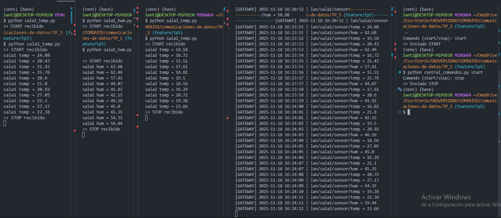
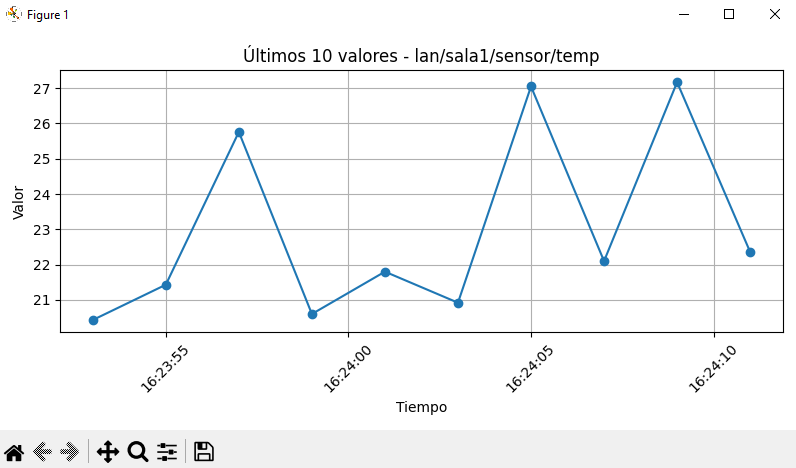
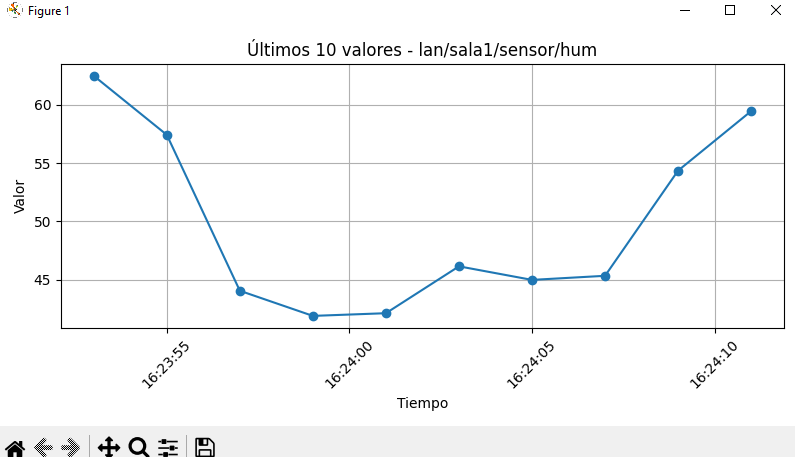
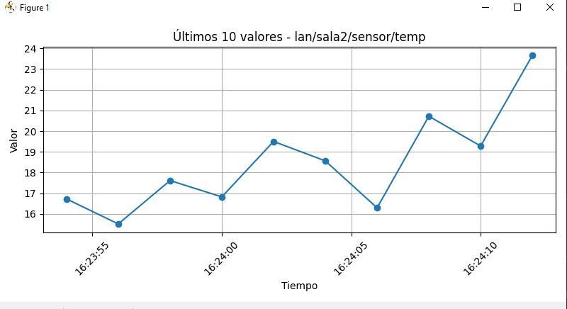

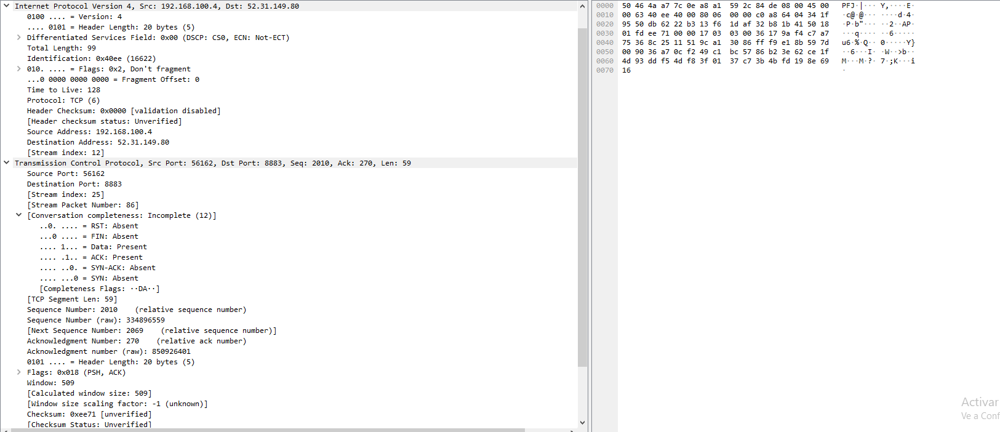